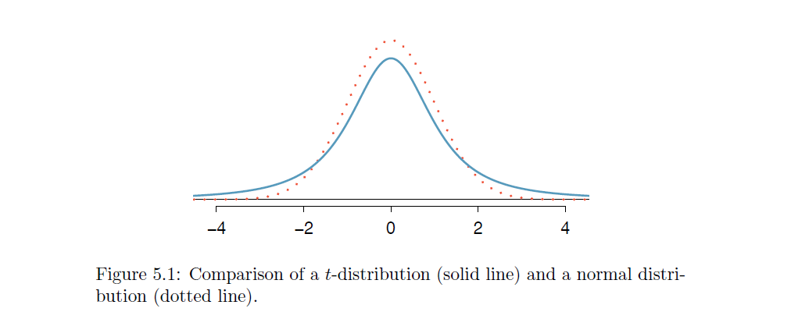
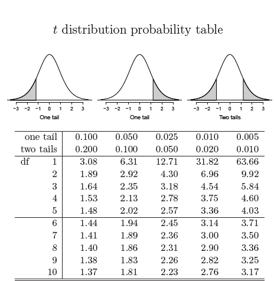
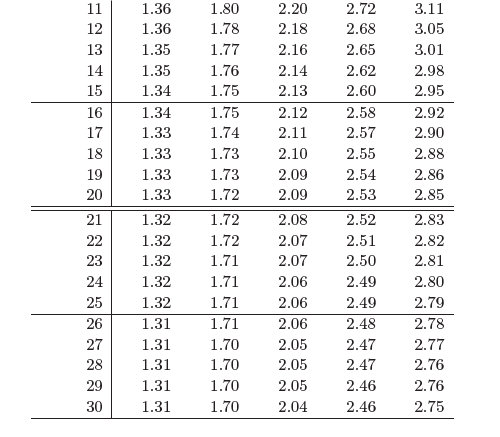
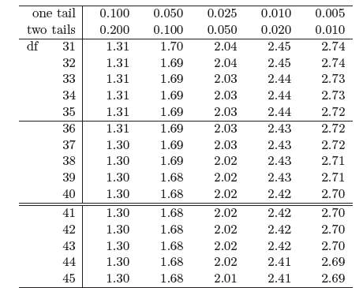
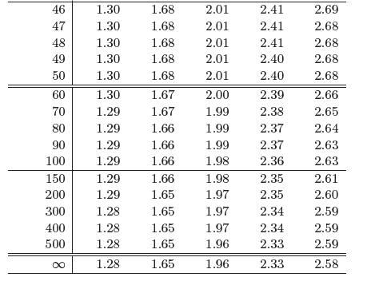
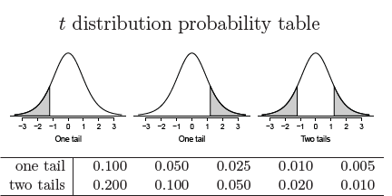

---
title: "Small Sample Inference Slides"
author: "Bekah Selby"
date: "April 8, 2019"
output:
  revealjs::revealjs_presentation:
    theme: sky
    highlight: pygments
    center: true

---


# Small Sample Inference 
##  Imagine: 
Imagine that you are doing an investigation of the average weight of pigs

 

## Would You Rather Trust

- A Sample of 30 pigs
- A Sample of 100 pigs
- A Sample of 100000 pigs

# Student t-distribution vs normal distribution

## Almost Normal
When you sample from very large distributions, $\bar{x}$ is distributed normally
$$\bar{x} \sim N(\mu,SE)$$
However, when you sample from small distributions, this no longer is satisfied


## Enter the Student t-Distribution

- Like the normal distribution, the student t-distribution is a symmetric one. 
- However, the "spread" or variance of the distribution will depend on the number of observations we sample
- We define the "degrees of freedom" or $df$ to be
$$df = N-1$$ 

## Student t-distribution


As $n \rightarrow \infty$, then the student t-distribution approaches the normal distributions

# t-statistic

## The t-statistic is calculated in the same way that out Z-score was:

$$t=\frac{\bar{x}-\mu}{SE}$$
Only now, our critical values come from the t-distribution with $df$ degrees of freedom.

## Example: two-sided tests
Suppose Kathy samples 30 pigs. She would like to test the following:
$$H_0: \quad \mu = 30$$ 
$$H_A: \quad \mu \neq 30$$

Her point estimate is $\bar{x}=25.16$ and the standard error is $SE=2.23$. Thus her t-statistic is
$t = \frac{25.16-30}{2.23}=$ `r (25.16-30)/2.24`


# Critical Values
Critical Values

## Table 1



## Table 1 



## Table 1 



## Table 1 



# Cathy's Pigs
## Results

- The critical value for a 90% test with $df=30-1=29$ is $\pm 1.70$
- The critical value for a 95% test with $df=30-1=29$ is $\pm 2.05$
- The critical value for a 99% test with $df=30-1=29$ is $\pm 2.76$

Cathy's t-statistic of $-2.16$ is significant with a 10% rejection region  (90% confidence) and a 5% rejection region (95% confidence) but insignificant with a 1% rejection region (99% confidence). 
$$t=2.16^{**}$$

## Practice: Two-sided tests

1. Andrew samples 20 pigs and finds the average weight is 22 with a standard deviation of 5. Can he reject the null hypothesis of a mean weight of 30? 
2. Nancy samples 100 pigs and finds the average weight is 35 with a standard deviation of 3. Can she reject the null hypothesis of a mean weight of 30? 

# One-sided Tests

## Example: 1-sided tests

We can also perform 1-sided tests with smaller samples. 
Imagine that we sample 50 states and calculate the murder rate in each state

$$\text{Murder Rate}=\frac{murders}{\text{100,000 population}}$$ 

```{r}
data("USArrests")
head(USArrests)
```

## Summary Statistics for Murder Rates 

```{r}
library(psych)
describe(USArrests$Murder,skew = FALSE)
# item name ,item number, nvalid, mean, sd, 
# median, mad, min, max, skew, kurtosis, se
```

## Hypothesis Test: 

$$H_0: \quad \mu = 5 $$
$$H_A: \quad \mu > 5 $$
Suppose we want to test to see if the mean murder rate is larger than 5 per 100,000 population. 

## Murder rate t-stat

$$t = \frac{7.79-5}{0.62}$$
= `r (7.79-5)/0.62`. 

- With 50 states, we use 49 degrees of freedom.

## Critical Value 



## Critical values:

- *: 1.30
- **: 1.68
- ***: 2.40

Since our t-stat of `r (7.79-5)/0.62` is larger than 2.40, we can reject the null hypothesis with 99% level of confidence. 

